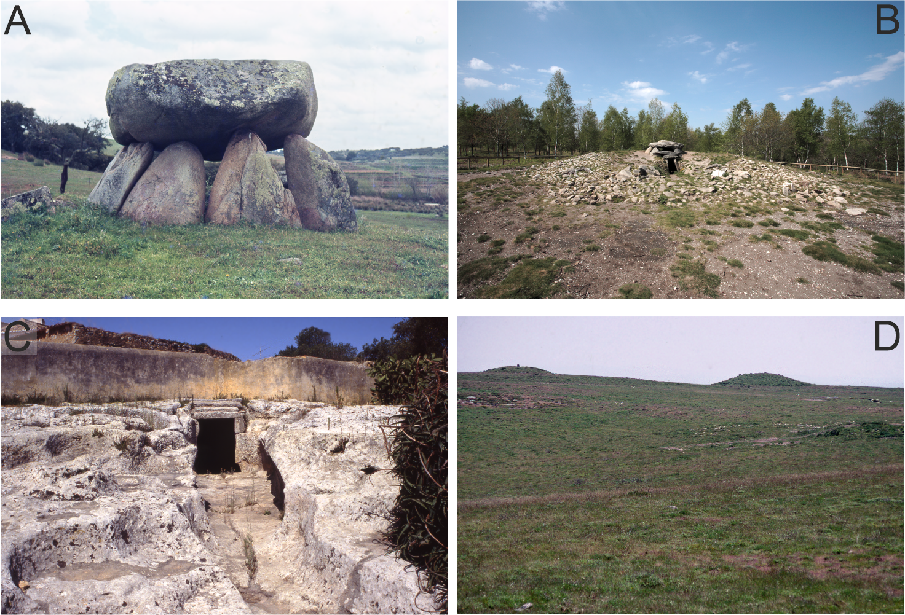
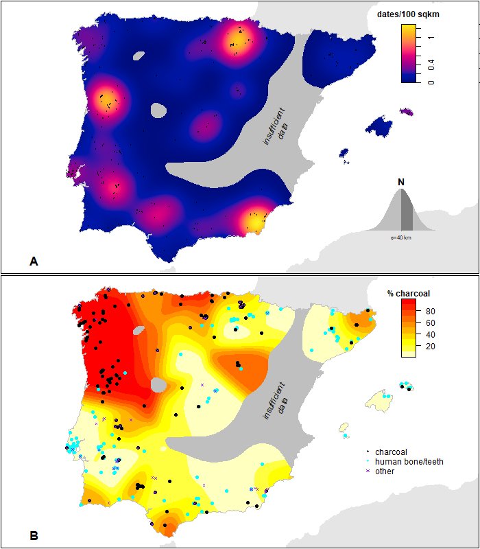

# Introduction

Megalithic monuments constitute a social and funerary phenomenon that first emerged ca. 5th millennium BCE and thereafter became a widely shared tradition amongst communities living in different parts of Atlantic Europe. In Europe, the term 'megalithic' architecture typically refers to large-scale, mixed earth and stone structures, often used as collective graves, and usually covered by a mound. More than 30,000 of these monuments are still preserved across Europe today, with areas such as Brittany and central Portugal showing a particular high density [@muller2014].

In archaeological terms, the megalithic complex is a typologically diverse funerary phenomenon which encompasses many different kinds of monument that were used and reused, often across millennia (@fig-megalithic-types).

```{r}
#| label: fig-megalithic-types
#| echo: false
#| warning: false
#| message: false
#| fig-cap: "Different megalithic architectures in the Iberian Peninsula. A: A Ordem (Alentejo); B: A Mámoa do Rei (Galicia); C: Rock-cut-tomb of Alapraia (Estoril); D: Mounds of Serra do Leboreiro (Northwest border of Portugal). Photographs by Prof. Antón A. Rodríguez Casal. Reproduced with permission."
#| out-width: "100%"


```

The chronology of European megalithic sites has been heavily debated among archaeologists over the last century, especially since the introduction of radiocarbon dating in the 1960s [@case1969; @renfrew1976]. The early models proposed in the 1930s suggested a diffusion of megaliths from the Near-East [@renfrew1976], but these explanatory hypotheses have subsequently been replaced by models that pointed out the existence of several European foci where megaliths would have emerged independently, namely Brittany, Portugal, Scandinavia and Ireland, amongst others [@renfrew1973]. Much of the recent research has dealt with how such megalithic architectures might have emerged, whether as a product of local innovation with strong Mesolithic roots [@bradley1998; @midgley2005; @vijande2015], or as a result of external influences [@callaghan2009; @carvalho2010; @cassidy2016; @schulzpaulsson2019; @sheridan2010; @zilhao2001]. Turning to the Iberian context in particular, pioneering works by, for example, Bosch-Gimpera and Pericot during the 1930s [@bosch-gimpera1925] proposed that it was two distinct regions, northern Portugal and north-western Spain (Galicia) that Iberian megaliths first appeared. This hypothesis relied on the documentation of archaeological materials from local Mesolithic traditions in several "proto-megalithic" chambers. Later, Bosch-Gimpera and Pericot's interpretations were contested by several authors. Forde (1930) [-@forde1930], for example, rejected a local origin and focused instead on the East Mediterranean, identifying the corbel-vaulted tholos as possible inspiration for the Iberian monuments. G. Leisner [-@leisner1938] and V. Leisner [-@leisner1965] proposed an alternative view arguing the possible contemporaneity of several types of funerary architectures (e.g., simple dolmens and passage graves).

The radiocarbon and thermoluminescence dates published from the 1960s onwards gradually started to add to this picture, showing that some of the small cist burials and the passage tombs in western Iberia, such as Poço da Gateira or Anta de Gorginos (central Portugal), were —in fact— older than the corbel-vaulted tholoi. These relatively early dates led Colin Renfrew to propose the south-central Portugal as one of the areas of Europe where megalithic architecture developed independently [@renfrew1976]. Renfrew's model continues to be popular among Iberian researchers: on this view, megaliths would have originated in the Alentejo region at the turn of the 5th millennium BCE, subsequently spreading to other Iberian areas and peaking as a phenomenon during the 3rd millennium BCE [@lillios2019; @munoz2021].

Recent treatments of the topic have added complexity to the origin and spread of the phenomenon in Iberia [@garcia-sanjuan2022], particular with the suggestion that their examples of "proto-megalithic" or "pre-megalithic" architecture, characterised by earth mounds with small internal chambers can be found in different areas of Iberia around the 5th millennium BCE. At the same time, an increasing number of archaeological examples across Europe [@bueno2016; @cassen2009; @gavilan2005; @laporte2010] have indicated that such "proto-megalithic" and early megalithic structures may have reused menhirs and standing stones that began life as part of stone-lined enclosures. A lack of radiocarbon dates [@lillios2019] continues to hinder severely any accurate reconstruction of the building episodes in these earliest "proto-megalithic" chambers, but even so, growing archaeological evidence, such as morphometric data, suggests that some menhirs are in fact re-used in those structures [@bueno2016; @cassen2009; @de-la-fuente1994; @laporte2010].

The grave goods found inside some Portuguese sites include microliths whose morphology can be traced back to local Mesolithic traditions [e.g. shell sites of Muge-Tajo, @lillios2019; @soares2000]. Sites such as Campo de Hockey (Cádiz) or Arroyo Saladillo (Antequera, Andalusia), provide clear examples of very well dated early proto-megalithic structures [@garcia-sanjuan2020; @vijande2009; @vijande2015]. The former, Campo de Hockey burial 11, comprises a double inhumation and a single burial dated to the second half of the 5th millennium BCE. Likewise, Tomba de Segudet, in Andorra, represents another proto-megalithic structure dating to the same period [@morell2018]. Those sites were used by @garcia-sanjuan2022 to provide one of the first diffusion models of Iberian megalithism based on a selection of 27 radiocarbon dates, concluding the existence of two centres of megalithic origin and spread in the Iberian Peninsula: the south-western regions of Andalusia and the East of the Iberian Peninsula.

In some areas, the origin of the megalithic phenomenon can be also read as a result of cultural interaction among different areas along the Atlantic coast, with Brittany playing a major role [@cassen2012; @cassen2019; @schulzpaulsson2017; @schulzpaulsson2019]. Several authors [@bueno2012; @lopez-romero2017; @rodriguez-rellan2020] have highlighted the existence of an important number of similar traits in the megalithic phenomenon of France, Ireland, Portugal and Atlantic Spain. These include common types of architecture, analogous graphical representations engraved inside the monuments [@cassen2015] and some shared material culture from within the structures. Among the latter portable objects, there is ample evidence for the circulation of polished axes made on Alpine jade [@fabregas2012; @petrequin2012] or the presence of body ornaments made of Iberian variscite among the grave goods of some of the major Breton mounds [@bosch2020; @rodriguez-rellan2020]. This growing body of evidence strongly suggests a significant degree of connectivity along the shores of Atlantic Europe of Western Europe since at least the Neolithic. These connections, in which maritime interactions probably played a very important role, would have allowed the exchange of objects but perhaps also the emergence of a set of shared beliefs and practices around the megalithic architectures [@cunliffe2001, p. 211], a pattern further supported by recent ancient DNA studies indicating population connections along the Atlantic façade [e.g. @sanchez-quinto2019].

Radiocarbon datasets are very important for understanding the megalithic phenomenon in Iberia, but they are not homogeneous in terms of dated material. In particular, the regions draining into the Atlantic Ocean facing a significant handicap with respect to certain organic samples. Acidic soils hinder the preservation of bones in burial contexts, a fact very visible for example in northwest Iberia, resulting in the absence of human skeletal remains and forcing radiocarbon dating to rely on charred wood (@fig-sample-bias). The result is a large-scale spatial dichotomy between the northern half of the Iberian Peninsula where the available radiocarbon dates are predominantly obtained from charcoal and the southern half, where dates are largely based on human bone samples. This paper revisits this dichotomy and suggests the presence of bias that has significant consequences for the conclusions which may currently be drawn.

```{r}
#| label: fig-sample-bias-code
#| eval: false
#| code-summary: "Code for Figure 2"
#| file: ../scripts/Figure 2.R
```

```{r}
#| label: fig-sample-bias
#| echo: false
#| warning: false
#| message: false
#| fig-cap: "A) The density of radiocarbon dates per 100 km² as potentially relevant to the Iberian megalithic phenomenon. B) The percentage of dates which are charcoal relative to total megalith-related dates in that area."
#| out-width: "100%"


```

@fig-sample-bias B clearly illustrates this spatial dichotomy: the chronology of northwestern megaliths and adjacent regions is mainly built over charcoal samples, whereas those from the south and east rely mostly on short-lived samples. This situation justifies the need to test models that specifically attempt to correct for this bias, or which exclude the use of charcoal in these regions altogether (as done by @garcia-sanjuan2022; @linares2022).

In numerical terms, of the 135 dates included in our database for north Iberian regions, 100 were obtained from charcoal (usually Quercus where known, but in most cases the species was not identified nor the part or the tree ring curvature). This pattern may be artificially causing older chronological trends in areas such as Galicia, Asturias, or northern Portugal due to an anticipated old wood effect (perhaps of 200 years in the case of oak, but potentially more for certain other species). This is the reason why previous work applied strict radiocarbon date hygiene protocols and only considered one date for Galicia and Asturias [@garcia-sanjuan2022].

In this paper, however, we move beyond traditional chronological compilations by critically evaluating the reliability of the whole, available radiocarbon record, with a particular focus on biases introduced by sample material (e.g. an "old wood effect"). We employ a robust statistical framework combining a Bayesian Phase model to estimate the origination date of megalithic construction in Iberia along with spatially-explicit, quantile regression models to discuss the origin and spread of the phenomenon. This combination allows us to formally test previous hypotheses regarding the origin of the phenomenon, and offer a new, statistically grounded perspective on one of the most relevant topics in the European later prehistory.
