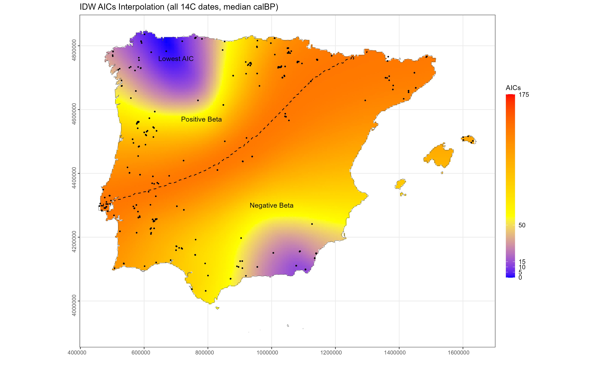

# Material and Methods

We have collected a total of 1,219 dates from 392 megalithic monuments, starting with Schulz Paulsson's important, open access dataset [@schulzpaulsson2017; @schulzpaulsson2019] and checking these individually against other major compendia, namely IDEArqC14 [@uriarte2017], CronoloGEA [@aranda2015] and "Cronología de la Prehistoria de la Península Ibérica" [SIAC, @alday2019]. We also carried out a revision of the grey regional literature to collect the latest radiocarbon dates and tried to define the architectural class for each of the sites.

From the initial number of dates, 172 were finally discarded, for reasons that are clarified in the supplementary material, alongside a detailed description of the database (see ESM 1 Database description). A final collection of dates encompasses different monumental typologies ascribed to the megalithic funerary phenomenon: menhirs and other non-funerary megalithic forms such as stone circles are not included in this work. We also excluded radiocarbon dates that have been interpreted in the literature as anomalous or unreliable because they are inconsistent with the established regional chrono-cultural sequence, as well as dates from dubious archaeological contexts (as indicated in the primary literature) or outside the studied periods (from the Neolithic to the Bronze Age). A detailed description of the explicit reasons for exclusion can be found in the database attached to this work. The resulting database spans a period from 5500-2500 BCE.

Radiocarbon dates were calibrated using OxCal [@bronkramsey1995], the *rcarbon* [@crema2021] and *oxcAAR* packages in R 4.5.1, applying the IntCal20 curve [@reimer2020]. To model the temporal dynamics of the phenomenon we implemented a Bayesian trapezoidal model [@lee2012; @crema2020] to formalise regional intensities as a generative process defined by four transition boundaries: onset, peak start, peak end, and disappearance. Posterior distributions for these parameters were estimated via MCMC sampling (N=100,000).

## Chronological and spatial modelling {#sec-spatial-modelling}

Recent research by Bettina Schulz Paulsson [-@schulzpaulsson2019] has defined a phase of megalithic expansion in Europe spanning the late 5th to the early 3rd millennium BCE, starting in northwest France and spreading throughout Europe, the Atlantic and Mediterranean coasts to several regions, such as Iberia. To model specific putative origin(s) in the Iberian Peninsula, we have followed the approach developed by @silva2015 in using quantile regressions of the radiocarbon dates and geodesic distances from several putative origin models.

Specifically, we modelled the relationship between each site date (median calibrated date as the dependent variable) and its distance from a selected putative origin (covariate) using quantile regression, with goodness of fit assessed from regressions of radiocarbon dates against Euclidean distances between points. For each origin point, we fitted a quantile regression

$$\text{CalBP} = \beta_0 + \beta_1 \times \text{Distance},$$

where CalBP is the median calibrated radiocarbon age of each site, Distance is its Euclidean distance from the origin point, $\beta_0$ is the intercept and $\beta_1$ the regression slope. Under a diffusion model, the expected relationship is positive ($\beta_1 > 0$), indicating younger sites increase distance from the source. Positive slope coefficients ($\beta_1 > 0$) indicate that site ages become progressively younger with the increasing of the distance from the origin point. Conversely, negative slopes ($\beta_1 < 0$) indicate the opposite pattern and therefore identify origins that are inconsistent with the hypothesized direction of spread.

All distances were computed as Euclidean distances in the projected coordinate system (UTM Zone 29N, EPSG:32629), rather than topographically alternative approaches such as least-cost paths. While topographic friction may influence the local movement in rugged terrain, we argue that at the peninsular scale of this analysis (~1,000 km) and given the broad chronological windows involved (centuries to millennia), Euclidean distances provide a reasonable first approximation. This approach is consistent with previous implementations of the method [@silva2015].

All analyses were conducted in the UTM Zone 29N coordinate system (EPSG:32629). To identify the origin which best fits the archaeological data we carried out an unconstrained search algorithm over a grid of 1,000 regular points spread over the Iberian Peninsula (approximate spacing of ~30 km) (see ESM 2 Technical descriptions). Those points were analysed as potential origins using quantile regression (τ = 0.90). The choice of τ = 0.90 was made to capture the 90th percentile of the age-distance relationship, representing a "diffusion front" of the earliest dates. For each origin, we fitted the quantile regression model and computed its Akaike Information Criterion (AIC). The origin point providing the lowest AIC was considered the best-fitting single-source model. To facilitate comparison among multiple origin areas, AIC values were converted into ΔAIC by subtracting the minimum AIC obtained across all grid points. Finally, ΔAIC values were interpolated using inverse distance weighting (IDW) for visualization purposes.

The identification of the origin for the spread was carried out by identifying origin points that would maximise out of sample predictive accuracy using AIC (a statistical criterion widely used for model selection and validation, see @burnham2002; @towner2007; @baddeley2016). The interpolated surface should not be interpreted as representing additional evaluated origins, but rather as a continuous representation of the underlying grid search (@fig-diffusion-model).

```{r}
#| label: fig-diffusion-model-code
#| eval: false
#| code-summary: "Code for Figure 3"
#| file: ../scripts/Figure 3.R
```

```{r}
#| label: fig-diffusion-model
#| echo: false
#| warning: false
#| message: false
#| fig-cap: "Inverse distance weighted (IDW) interpolation of ΔAIC values derived from a grid-based quantile regression analysis. Lower ΔAIC values indicate a better statistical fit of an origin point to the observed age–distance relationship. The dashed contour marks the boundary where the regression slope (β₁) equals zero, separating origins producing positive (β₁ > 0) and negative (β₁ < 0) age–distance relationships. The global minimum ΔAIC among the evaluated grid points is located in northwestern Iberia. Although the interpolated surface also shows a secondary area of relatively low ΔAIC values in the southeast, this feature results from the IDW interpolation used for visualization and does not represent an equivalent optimum in the underlying grid search."
#| out-width: "100%"


```

This approach substantially differs from others such as data filtering, weighted regression or ordinary least square regression. As @silva2015 [p. 5] note, the quantile regression is a robust approach as it can approximate a low quantile without having to subset the data or choosing an ad hoc weight function which could influence the results. @silva2015 also note that the spread algorithm inherently looks for the best-fitting single source (the specific area with lowest ΔAIC). Therefore, it does automatically encourage identification of multiple origin points. To further consider multiple origins, we built other possible spread models with multiple origin points at the same time and compared them to the one that best fits the archaeological data. These models are the current views on the topic based on archaeological literature [@cassen2012; @fabregas2012; @lopez-romero2017; @molist2010; @rodriguez-rellan2020; @schulzpaulsson2019; @garcia-sanjuan2022], as follows:

1. North-western origin (NW): territories comprising the Northwestern area of Spain (mainly Galicia and Asturias) and the North of Portugal. The specific points to report depend on the analytical results (unconstrained search).
2. South-western origin (SW): located in the Algarve region. Longitude: -8.182; Latitude: 37.250.
3. North-eastern origin (NE): located in the Tavertet region (Catalonia). Longitude: 2.516; Latitude: 42.031.
4. Double origin: comprising the NW and SW points.
5. Campo de Hockey origin: located in San Fernando, Cádiz.
6. Double origin: comprising Campo de Hockey and Northeast points.
7. Triple origin: comprising NW, SW and NE points of origin.

We calculated the ΔAIC value for these models to identify the most probable origin point. This comparison was conducted across three analytical scenarios: (1) the raw radiocarbon dataset, (2) a dataset corrected by −500 years for charcoal samples from high-charcoal regions, and (3) a bone/teeth-only subset. The full results of this model comparison, including AIC values, regression slopes, and estimated diffusion velocities, are provided in Table S1.

## Spatial analyses of sample types {#sec-sample-types}

Previous approaches to the origin and spread of the megalithic complex in Iberia addressed the topic using descriptive plots and interpolation of radiocarbon dates [e.g. @schulzpaulsson2017; @schulzpaulsson2019; @garcia-sanjuan2022]. While these studies acknowledge well-known issues associated with radiocarbon dating, particularly the old wood effect in charcoal samples, they do not incorporate this uncertainty into their spatial modelling, instead opting to exclude such dates.

To evaluate the potential impact of the old-wood effect on our diffusion models, we implemented two complementary analytical approaches:

1) a spatial analysis of the distribution of dated materials using kernel density estimation (σ = 40 km), identifying regions of Iberia where charcoal samples represented >70% of the dated assemblage. This threshold corresponds to approximately the 66th percentile of the charcoal percentage distribution across Iberia and was selected to identify areas with the highest concentration of charcoal dates while avoiding an overly restrictive definition.

2) A sensitivity analysis in which the median calibrated ages of charcoal samples from these high-charcoal regions were progressively reduced by 0-1,200 years in 100-year increments, simulating increasing magnitudes of the old-wood effect. For each correction scenario, the complete quantile-regression analysis was rerun across all origin points. The location yielding the lowest AIC was recorded for each iteration, allowing us to evaluate whether progressively larger old-wood corrections resulted in a spatial shift of the inferred diffusion origin. For our general diffusion model, we determined a critical threshold which helped us to value the precise magnitude of error required to shift between hypothetical origin centers. This was defined as the minimum correction value at which the optimum origin center exceeded 700km (UTM 29), generally representing the geographic transition from Northwest to Eastern Iberia. Confidence intervals were calculated via bootstrap resampling (n=1,000 iterations), yielding a 95% confidence interval.

The statistical thresholds were contextualized with specific data from palynological analyses and archaeological contexts. In the context of NW Iberia, the dominance of *Quercus* sp (Oak) can be seen, a long-lived genus (from 300 to 1,000 years) alongside shorter-lived taxa such as *Corylus* (Hazel) (<100 years) (see ESM 2). By mapping these lifespans in a "sensitivity curve", we were able to define two analytical zones: a short-live species (0-100 years offset), and a long-lived lifespan (300-1,000 years offset).

## Regional spatio-temporal trajectories

The onset of the emergence, peaking, and disappearance of the megalithic phenomenon across different regions were inferred using a Bayesian trapezoidal model. By treating the radiocarbon record as a proxy for megalithic intensity, we defined four transition parameters (onset, peak, decline, and disappearance), which were estimated in six pre-defined regions in the Iberian Peninsula. Raw posterior estimates (median, 95% HDPI) and Bayesian model agreement indices (Amodel) for each region and parameter are provided in Tables S2 (full dataset) and S3 (bone/teeth only).

This approach allows for a formal characterization of patterns in the adoption and consolidation of megalithic practices while explicitly modelling chronological uncertainty associated with the radiocarbon record and cultural phase transitions. The resulting posterior distributions provide probabilistic estimates of the intensity of the phenomenon, distinguishing between initial pioneer events and the long-term establishment of monumental funerary landscapes. As a sensitive approach, we have also compared Bayesian trapezoidal models from bone and teeth samples, representing direct dates of monument use, against the full radiocarbon dataset (bone and charcoal combined). This comparative analysis was restricted to the four regions with sufficient bone dates (East, Tagus Basin, South, and Ebro Basin), allowing us to evaluate the extent to which charcoal-derived dates effect introduce temporal shifts in each regional sequence.
