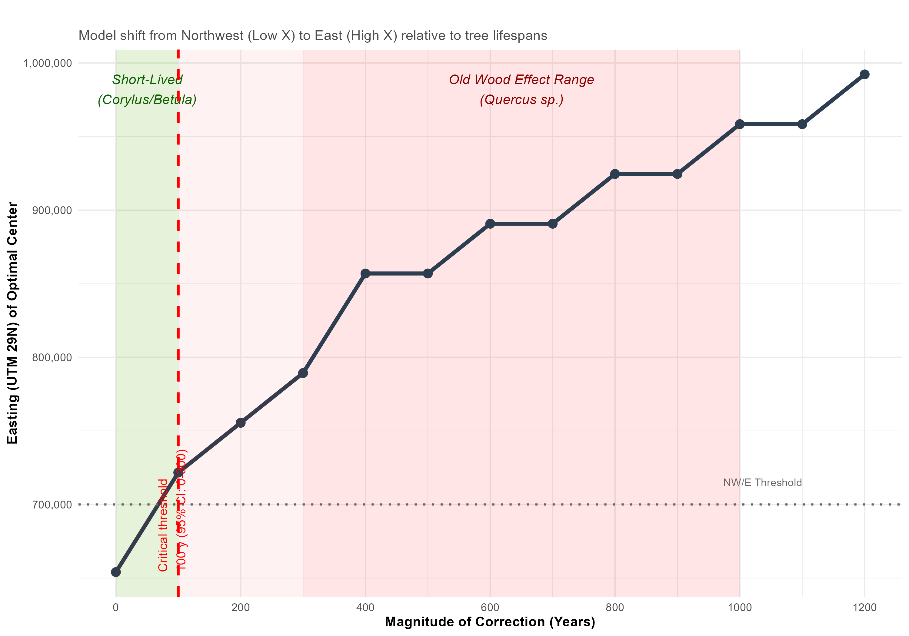
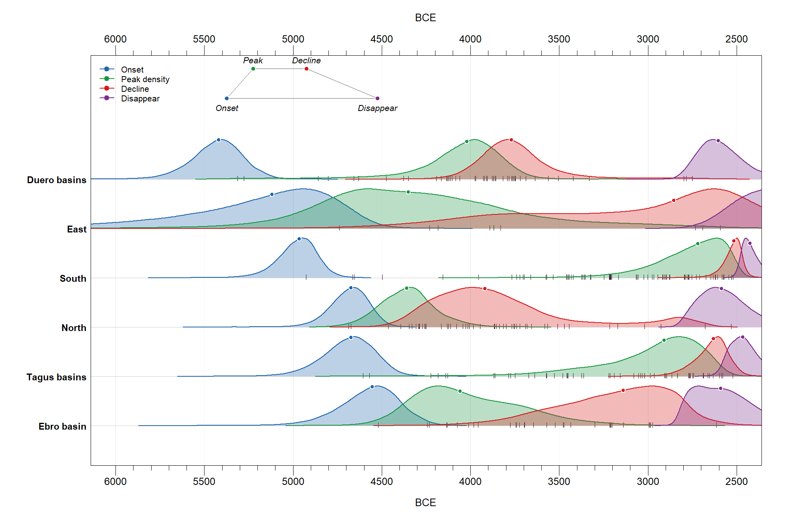
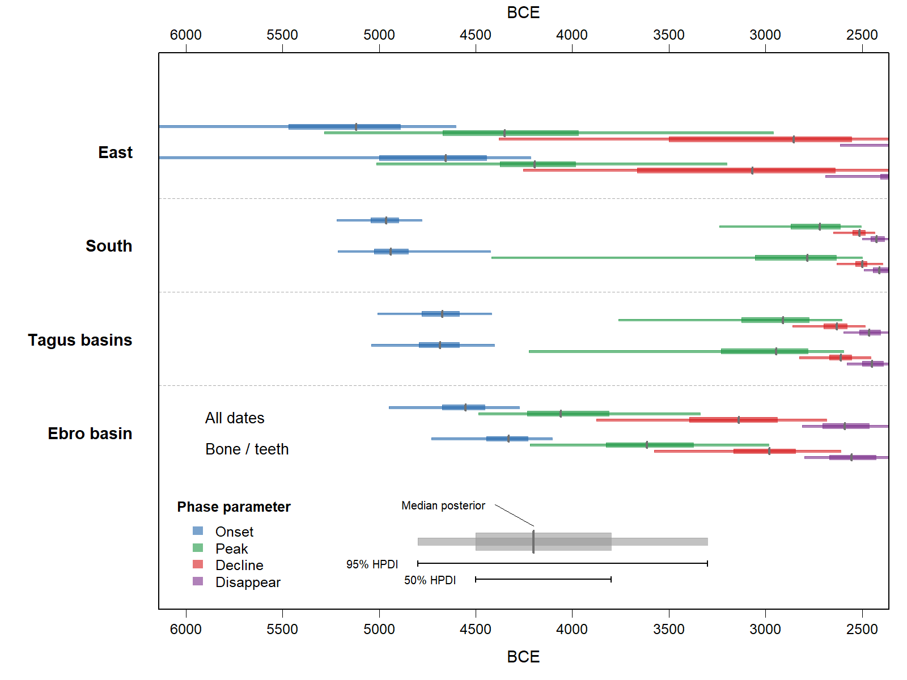

# Results

Sensitivity analysis revealed a non-linear response of the diffusion model to radiocarbon age corrections (@fig-sensitivity-analysis). Under zero-correction conditions (Step 0), the model identifies the Northwest as the optimal point of origin, reproducing the pattern observed in the dataset with the whole collection of dates. However, the inferred northwestern origin is not robust to plausible age corrections. Specifically, a critical threshold is identified at approximately 100 years, meaning that age corrections exceeding this threshold cause the model's optimal origin to shift from the Northwest to the Eastern regions. As the dominant taxon in the record is *Quercus* (oak), the lifespan range clearly exceeds this critical threshold. Consequently, a northwest origin model is only credible if no old-wood effect is assumed—an assumption contradicted by the prevalence of ancient oak charcoal in megalithic contexts in the regions considered.

```{r}
#| label: fig-sensitivity-analysis-code
#| eval: false
#| code-summary: "Code for Figure 4"
#| file: ../scripts/Figure 4.R
```

```{r}
#| label: fig-sensitivity-analysis
#| echo: false
#| warning: false
#| message: false
#| fig-cap: "Sensitivity of the data-driven megalithic origin model which identifies a possible NW origin model due to 'old wood' effect."
#| out-width: "100%"


```

The results of the probabilistic estimates of regional megalithic phases in Iberia reveal a clear diachronous pattern in the adoption and consolidation of the megalithic complex (@fig-ckde-regions).

```{r}
#| label: fig-ckde-regions-code
#| eval: false
#| code-summary: "Code for Figure 5"
#| file: ../scripts/Figure 5.R
```

```{r}
#| label: fig-ckde-regions
#| echo: false
#| warning: false
#| message: false
#| fig-cap: "Probabilistic estimates of regional megalithic phases in Iberia. Posterior probability distributions for the four parameters of a trapezoidal model: onset (blue), peak (green), decline (red), and disappear (purple). Regions are ordered by the median posterior estimate of their onset boundary. The density plots represent the posterior probability distributions of each parameter. Dots indicate the posterior median estimated from 100,000 MCMC samples. Vertical ticks along each baseline indicate the median calibrated age of each radiocarbon sample included in the corresponding regional model."
#| out-width: "100%"


```

The posterior distributions for the onset parameters identify a primary emergence centered on the Duero, East and Southern regions, where the transition to megalithic construction occurs with high probability during the final centuries of the 5th millennium BCE. In the Southern area there is a clear temporal lag between the earliest documented burials and the point of maximum megalithic building, suggesting that while the first monuments appeared early (probably as a result of pioneering phases), it took several millennia for megalith construction to become established at a regional scale, unlike in the North, where the transition from emergence to peak was quite more immediate.

The posterior estimates indicate that the transition from peak to decline was generally more gradual in the southern and Tagus basin regions than in the northern regions, although uncertainty remains considerable. Accordingly, the northern regions show a relatively rapid transition from peak to decline, whereas the southern and Tagus basin trajectories exhibit greater temporal persistence, with the disappear parameter extending well into the 3rd millennium BCE. This statistical framework highlights that the megalithisation of the Iberian Peninsula was not a synchronized event, but a complex mosaic of regional commitments, as recently suggested [@barroso2026]. The apparent abruptness of the peak-to-decline transitions in the Tagus basin and the South may partly reflect the structure of the radiocarbon record in these regions rather than a genuine demographic signal. In the South, the high density of well-dated sites from the third millennium BCE, associated with the emergence of large, structured necropolises such as Antequera, may be compressing the posterior distribution of the decline parameter relative to regions with sparser late-phase evidence. Similarly, in the Tagus basin, the long temporal interval between onset and peak posteriors (ca. 1,700 years in the bone/teeth model) should be interpreted considering the number of securely dated early sites, which generates wide credible intervals rather than a genuine plateau of monumental activity. We therefore call for caution against interpreting the steepness of individual regional trajectories as literal demographic signatures without considering the underlying sample size and site diversity.

The patterns observed in the regional Bayesian model also contrast with the results of our Iberian dispersal models (ESM Table S1). While the comparison based on all radiocarbon dates (raw models) points towards a primary Northwestern signal for the emergence of megalithic sites, this result is highly sensitive to the use of charcoal samples. When an "old wood effect" correction of -500 years is applied to charcoal dates of the North and Duero basins (where exceed 80% of the total dates), the statistical center of gravity for the origin shifts significantly toward the interior of the Iberian Peninsula. This apparent tension between regional onsets and an Iberian trend can be explained by the different demographic signals captured by each method. While the trapezoidal models are sensitive to early events, the quantile regression identifies the chronological gradient.

When the analysis is restricted to only human bone dates (n = 603; 59.7% of the dataset), a significantly different origin in the center-south interior is identified, specifically in the region encompassing Toledo, Ciudad Real, and northern Andalusia. Sites in the Tagus Basin are pivotal in this inland pull (ESM Table S1). For instance, the Dolmen of Azután (Toledo) and El Castillejo provide human bone dates as early as 4850-4300 BCE, a signal further anchored by another old human remains in the entire dataset: Cerro Virtud (Almería) at 5050-4650 BCE and Montelirio (Seville) at 4750-4550 BCE. It should be noted, however, that some of these monuments such as Azután are complex multi-period contexts, and these early dates should therefore be treated as provisional pending more systematic contextual and taphonomic review, rather than secure termini post quem for the onset of megalithic construction in the Tagus basin.

A potential source of uncertainty in dates derived from human remains is the marine reservoir effect, where marine-based diets can lead to uncalibrated ages appearing artificially older. While significant marine consumption could potentially bias spatial models in coastal territories, existing stable isotope research on Iberian megalithic individuals generally suggests a predominantly terrestrial diet [e.g. @fontanalscoll2016; @diaz-zorita2019], with marine contributions appearing minor. In fact, 241 human bone remains in our dataset shows a mean δ13C value of -19.3‰ (max = -19.0‰), confirming a strictly terrestrial diet and ruling out any significant marine reservoir effect.

Consequently, a Northwestern origin model appears to be partially influenced by the potential old-wood bias of charcoal in that region. A bone-only model, supported by recent evidence from the Iberian Plateau [e.g., Valdelasilla site; @barroso2026] and the early megalithic clusters in the Duero and Tagus basins (e.g., Areita 1, Arquinha da Moura, Rego da Murta), suggests that the emergence of the megalithic phenomenon was not a unidirectional coastal diffusion but a multifocal process involving simultaneous developments across the Atlantic, the Mediterranean façades and the Iberian interior. In fact, regional comparisons between the bone/teeth trapezoidal models and the full radiocarbon dataset help visualising a picture like this (@fig-bone-vs-owe-600, Table S3).

Charcoal samples systematically appear to push the estimated onset of the megalithic activity towards older chronologies, a bias which appears most pronounced in the East region, where the full dataset posterior spans a considerably earlier range (95% CrI: 4604–6684 BCE) than the bone/teeth model (95% CrI: 4214–6254 BCE), with the central tendency shifting by over 460 years. It should be noted that both intervals remain extremely wide and largely overlapping due to the sparse early dating evidence. Similarly, in the Ebro basin, the full dataset consistently yields earlier estimates than the bone/teeth model, with a shift of over 200 years in the central tendency. Conversely, the South and Tagus basins exhibit a remarkable consistency between both datasets, with largely overlapping posterior distributions and central tendencies differing by fewer than 25 years, suggesting that charcoal dates in these interior regions might be less affected by an old wood bias. Overall, these results confirm that relying on charcoal dates without short-lived confirmation can severely distort the estimated chronology of the megalithic phenomenon.

```{r}
#| label: fig-bone-vs-owe-600-code
#| eval: false
#| code-summary: "Code for Figure 6"
#| file: ../scripts/Figure 6.R
```

```{r}
#| label: fig-bone-vs-owe-600
#| echo: false
#| warning: false
#| message: false
#| fig-cap: "Comparison of regional megalithic phases between bone and teeth dates and the full dataset. The plots show the posterior probability distributions for the four trapezoidal parameters (onset, peak, decline, and disappear) across the East, Tagus basins, South, and Ebro basin regions. For each parameter horizontal bars represent the 95% and 50% highest posterior density intervals (HPDI), respectively, while vertical grey lines indicate the posterior medians estimated from 100,000 MCMC samples."
#| out-width: "100%"


```
